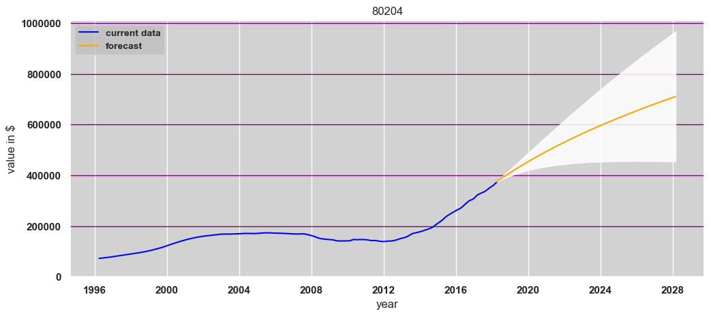
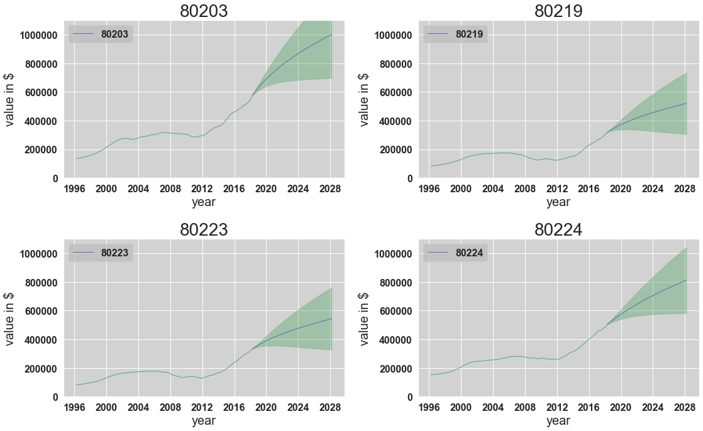
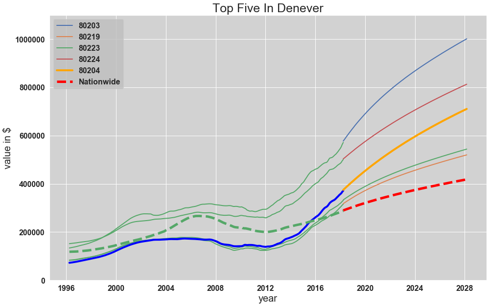
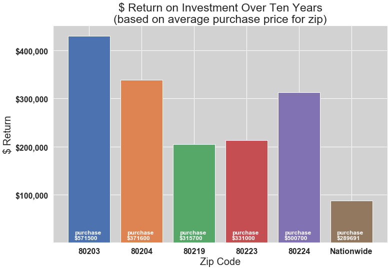

**Important Documents**

Slide presentation in PDF format
presentation.pdf

Main code notebook:
student.ipynb

**Related Links:**

Blog Post:
<https://terryollila.github.io/parameter_wrangling_on_massive_data_sets>

Video Presentation:
<https://vimeo.com/389132045>

# Premise

The purpose of this analysis is to explore  the forecasting for multiple zip codes in the United States in order to assess the best possible opportunities for real estate investment.

In pursuit of this investigation, I will attempt to begin at a national level, using ARIMA and/or SARIMAX methodology and modeling to assess the most promising locations. To do this, I will begin with the strongest state as determined by average forecasted percent return on investment over the next ten years, and from there, find the strongest county within that state, then the strongest city within that county, and finally the five zip codes within that city, again, all judged by percent return on investment over the next ten years.

The models will be tuned in such a way as to capture this information with the greatest precision and accuracy as possible before drilling down to the state, county, city, and ultimately zip code levels. 

I will not attempt to ascertain the top five zip codes in the entire country. Instead I will attempt to locate the top zipcodes in the top city of the top county of the top state. This method will ensure strength in the surrounding areas, rather than pursuing what could be isolated zip codes showing unsustainable and perhaps misleading or illusory figures. 

# Conclusions

Analyzing an entire nation of zipcodes is not going to be as precise as measuring a handful of zip codes at once. However, with a little work we can create some modeling that can, at the very least, drill into the zip codes that are, if not at the very top, at least near the top in terms of percent growth over the coming years.

The thing I did *not* do was to simply take the five top zip codes in the country. There is too much possibility for error with that tactic, and the areas picked would lack the strength of the surrounding areas to mitigate risk. Also, those zipcodes could be isolted flukes.

Instead, in trying to mitigate risk and hone in on the best overall area, and then the best zipcodes within that area, I began at the state level and picked the state with the top average percent gain over ten years. I then drilled down to the county level and picked the top county. From there, I went to the top city, and picked zipcodes from there. This process should insulate the picks from risk as it accounts for strength not only in its own area, but in the surrounding area as well. The strongest zips from the strongest cities from the strongest counties from the strongest state.

In the end, Colorado was the top state, with Denver being the top country, Denver also being the top state, and the five zip codes listed below as the top 5 recommended zip codes for real estate investment nationwide. Since all five were in close proximity to each other, I feel that this reflects great strength in the area and the chances of any one of these zipcodes having come from any sort of anomaly is extremely low.

Oh yes, and for all you sports fans, the top zip encompasses both Mile High Stadium and the Pepsi center.

## Growth Line Comparisons

The top zip code of all was 80204:

Denver has been experiencing explosive growth in recent years as a magnet for technology companies new and old to gather. 

You don't necessarily need to buy right close to the stadiums, though, and fight all that traffic. These other zip codes are also very strong in their own right, and none of them is far from downtown.

80203, 80219, 80223, 80224.

Plotting them all together for comparison.

Getting 10 year forecast figure for Nationwide model since that information doesn't yet exist outside of a function.

## Growth Bar Comparisons

Bar graphs to demonstrate return on investment over the next ten years.

Similarly represnting the dollar amonunt of gain over ten years given a purchase price of the current average. 80203 takes top honors there, but you'll need a fatter pocket book to make that money.

## Summary Table

Finally, I'll put together a final table to display 5 and 10 year growth figures for the 5 top zip codes.
This wraps up the analysis with a succint summary of figures for the top 5 zip codes in my analysis.

<table border="1" class="dataframe">
  <thead>
    <tr style="text-align: right;">
      <th></th>
      <th>80203</th>
      <th>80204</th>
      <th>80219</th>
      <th>80223</th>
      <th>80224</th>
    </tr>
    <tr>
      <th>Return</th>
      <th></th>
      <th></th>
      <th></th>
      <th></th>
      <th></th>
    </tr>
  </thead>
  <tbody>
    <tr>
      <th>start_list</th>
      <td>571500.00</td>
      <td>371600.00</td>
      <td>315700.00</td>
      <td>331000.00</td>
      <td>500700.00</td>
    </tr>
    <tr>
      <th>5 Yr Return %</th>
      <td>0.46</td>
      <td>0.53</td>
      <td>0.40</td>
      <td>0.39</td>
      <td>0.36</td>
    </tr>
    <tr>
      <th>5 Yr Returns $</th>
      <td>265053.00</td>
      <td>197919.00</td>
      <td>125494.00</td>
      <td>130298.00</td>
      <td>180770.00</td>
    </tr>
    <tr>
      <th>10 Yr Return %</th>
      <td>0.75</td>
      <td>0.91</td>
      <td>0.65</td>
      <td>0.64</td>
      <td>0.62</td>
    </tr>
    <tr>
      <th>10 Yr Return $</th>
      <td>429755.00</td>
      <td>338964.00</td>
      <td>204298.00</td>
      <td>213002.00</td>
      <td>312266.00</td>
    </tr>
  </tbody>
</table>

